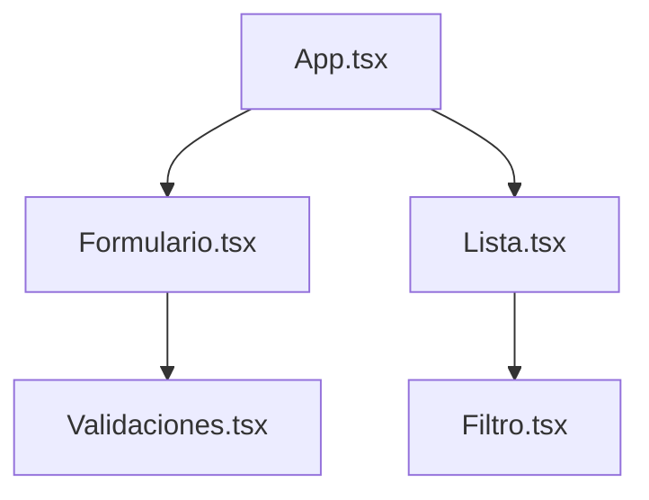

# Ejercicio CRUD Básico con React y TypeScript

Este proyecto es un ejercicio básico desarrollado con React y TypeScript. La aplicación permite crear, leer, actualizar y eliminar elementos de una lista, además de filtrar los elementos por nombre.

## Características

- Crear, editar y eliminar elementos.
- Filtrar la lista por nombre.
- Validaciones de entrada.
- Interfaz sencilla y responsiva.

## Diagrama de Estructura de Carpetas

```
ejercicio_crud/
│
├── src/
│   ├── App.tsx
│   ├── index.css
│   ├── main.tsx
│   ├── components/
│   │   ├── Formulario.tsx
│   │   └── Lista.tsx
│   └── utils/
│       ├── Filtro.tsx
│       └── Validaciones.tsx
│
├── public/
│   └── vite.svg
│
├── package.json
└── README.md
```

## Diagrama de Flujo de la Aplicación



## Instalación

1. Clona el repositorio:

   ```sh
   gh repo clone SebastianWebApp/React
   cd ejercicio_crud
   ```

2. Instala las dependencias:
   ```sh
   npm install
   ```

## Uso

- Inicia el servidor de desarrollo:
  ```sh
  npm run dev
  ```

## Estructura principal

- `src/App.tsx`: Componente principal.
- `src/components/Formulario.tsx`: Formulario para crear y editar elementos.
- `src/components/Lista.tsx`: Lista de elementos.
- `src/utils/Filtro.tsx`: Componente para filtrar la lista.
- `src/utils/Validaciones.tsx`: Funciones de validación.

## Tecnologías

- React
- TypeScript
-
